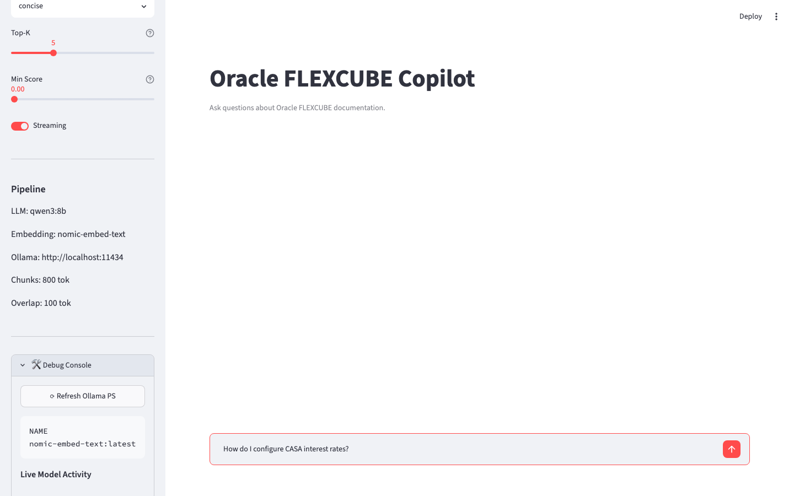

# Oracle FLEXCUBE Copilot

RAG-powered assistant for Oracle FLEXCUBE documentation. Uses hybrid retrieval (vector + BM25 + RRF) over 179 Oracle PDFs to answer questions via Qwen3:8B (Ollama).



---

## Benchmark Results

Evaluated against 95 questions spanning GL, CASA, Loans, Islamic Banking, Security, CommonCore, Charges, Interest, Products, Term Deposits, and Tax modules.

| Retrieval Mode | Hit@5 | MRR | NDCG@10 |
|---------------|-------|-----|---------|
| Dense only    | —     | —   | —       |
| BM25 only     | —     | —   | —       |
| Hybrid (RRF)  | 9.47% | 0.0996 | 0.1225 |

**Latency:** 29.7 ms avg embedding · 44.0 ms avg retrieval

> Hybrid RRF still underperforms on document-level benchmarks because the dataset uses document-level relevance while retrieval operates at chunk granularity. Next steps: per-chunk relevance labelling, tuned retrieval alpha, entity retriever integration.

---

## Architecture

```
Oracle PDFs (179)
       │
       ▼
  ┌──────────────────────────────────────────┐
  │  Ingestion Pipeline                      │
  │  ┌─────────┐ ┌──────────┐ ┌───────────┐ │
  │  │ Extract │→│ Enrich   │→│ Chunk     │ │
  │  │ (pdfpl  │ │ (headings│ │ (semantic │ │
  │  │  umber) │ │ entities)│ │  sections)│ │
  │  └─────────┘ └──────────┘ └───────────┘ │
  └──────────────────────────────────────────┘
       │
       ▼
  ┌────────────────────────────────────────┐
  │  Index Layer                           │
  │  ┌──────────┐  ┌──────────┐            │
  │  │ ChromaDB │  │   BM25   │            │
  │  │ (dense)  │  │ (sparse) │            │
  │  └──────────┘  └──────────┘            │
  └────────────────────────────────────────┘
       │              │
       └──────────────┘
              │
              ▼
     RRF Fusion (k=60)
              │
              ▼
     ┌────────────────┐
     │  Prompt Builder │
     │  (XML context)  │
     └────────────────┘
              │
              ▼
     ┌────────────────┐
     │  Qwen3:8B      │
     │  (Ollama)      │
     └────────────────┘
              │
              ▼
     Answer + Citations + Confidence
```

---

## Prerequisites

- **Python 3.11+** (project targets 3.14 for pattern matching and `list[...]` type syntax — runs fine on 3.11+)
- **Ollama** with `qwen3:8b` and `nomic-embed-text`
- ~8 GB RAM

---

## Quick Start

### One-click launcher

```bash
./start-ui.sh
```

Checks Ollama, pulls missing models, creates venv, installs deps, launches UI at `http://localhost:8501`.

### Manual

```bash
python3 -m venv .venv && source .venv/bin/activate
pip install -e ".[dev]"

# Index PDFs (one-time)
oracle-copilot ingest docs/

# Ask a question
oracle-copilot ask "How do I configure CASA interest rates?"

# Launch UI
make ui
```

---

## CLI Reference

| Command | Description |
|---------|-------------|
| `ask` | Answer a question using RAG |
| `ingest` | Index PDF documents |
| `search` | Retrieve chunks without LLM |
| `prompt` | Inspect the assembled prompt |
| `benchmark` | Run evaluation metrics |
| `stats` | System health check |

### `ask` — modes

```bash
oracle-copilot ask "question" --mode concise      # 2-5 sentences (default)
oracle-copilot ask "question" --mode detailed      # Full step-by-step
oracle-copilot ask "question" --mode expert        # Technical + cross-refs
```

| Mode | Description |
|------|-------------|
| `concise` | 2-5 sentence summary with key points |
| `detailed` | Step-by-step instructions with navigation |
| `expert` | Technical deep-dive with cross-references |

---

## User Interface

```bash
make ui      # opens at http://localhost:8501
```

**Chat features:**
- Streaming token display with live speed (tok/s)
- Mode selector, Top-K slider, Min Score filter
- Per-answer Sources & Metrics expander (citations, confidence, timing, tokens)

**Debug Console** (sidebar expander — not in main UI):
- **⟳ Ollama PS** — refreshable `ollama ps` output (PID, model, uptime, VRAM)
- **Live speed gauge** — real-time tokens/sec and token count during generation
- **Raw prompt preview** — first 2000 chars of the XML prompt sent to the LLM
- **Retrieval breakdown** — which chunks matched, scores, retrieval methods

---

## Configuration

Environment variables or `.env` file:

| Variable | Default | Description |
|----------|---------|-------------|
| `OLLAMA_BASE_URL` | `http://localhost:11434` | Ollama server URL |
| `EMBEDDING_MODEL` | `nomic-embed-text` | Embedding model |
| `LLM_MODEL` | `qwen3:8b` | Generation model |
| `LLM_TEMPERATURE` | `0.1` | Sampling temperature |
| `LLM_TOP_P` | `0.9` | Nucleus sampling |
| `LLM_REPEAT_PENALTY` | `1.1` | Token repeat penalty |
| `LLM_NUM_CTX` | `8192` | Context window size |
| `LLM_MAX_TOKENS` | `2048` | Max response tokens |
| `LLM_TIMEOUT` | `120` | Request timeout (s) |
| `CHUNK_SIZE` | `800` | Chunk token target |
| `CHUNK_OVERLAP` | `100` | Chunk overlap tokens |
| `TOP_K_RETRIEVAL` | `5` | Default top-K |
| `RETRIEVAL_ALPHA` | `0.5` | Dense/sparse balance |
| `PROMPT_MAX_TOKENS` | `4096` | Max prompt budget |
| `PROMPT_MIN_SCORE` | `0.0` | Min retrieval score |
| `LOG_LEVEL` | `INFO` | Logging level |
| `LOG_FORMAT` | `text` | `text` or `json` |

---

## Project Structure

```
src/oracle_flexcube_copilot/
├── cli.py                 # Click CLI
├── config.py              # Pydantic settings
├── chunking/              # Semantic section chunking
├── embedding/             # nomic-embed-text + disk cache
├── enrichment/            # Headings, entities, tables, hierarchy
├── evaluation/            # Benchmark, metrics, reporting
├── indexing/              # ChromaDB, BM25, entity index
├── ingestion/             # PDF parsing, metadata
├── llm/                   # Ollama client, generator, streaming
├── prompting/             # XML prompt builder, system templates
├── retrieval/             # Vector, BM25, RRF fusion
└── ui/                    # Streamlit chat interface

tests/                     # 45 files across 11 test packages
docs/                      # 179 Oracle PDFs (~1.2 GB)
```

---

## Development

```bash
make install       # Install dependencies
make lint          # Ruff check + format
make typecheck     # mypy
make test          # pytest + coverage
make clean         # Remove artifacts
```

### Evaluation

```bash
oracle-copilot benchmark benchmark_dataset.yaml --top-k 10
```

Dataset format:

```yaml
queries:
  - question: "How do I configure CASA?"
    relevant_docs: ["CASA.pdf", "Interest.pdf"]
    module: "CASA"
```

---

## GitHub Topics

When searching the repo, add these topics:

```
rag, llm, oracle-flexcube, python, information-retrieval, streamlit, ollama, chromadb, qwen, hybrid-search
```

---
